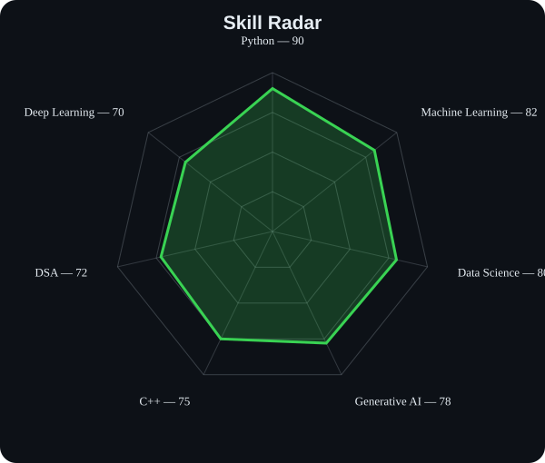
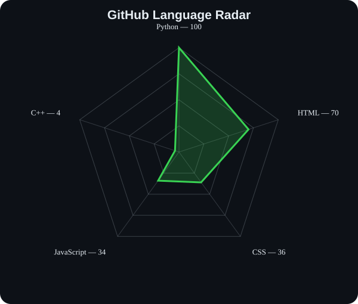
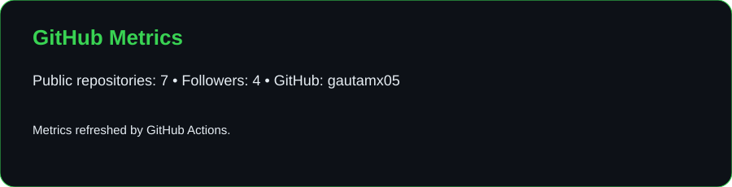
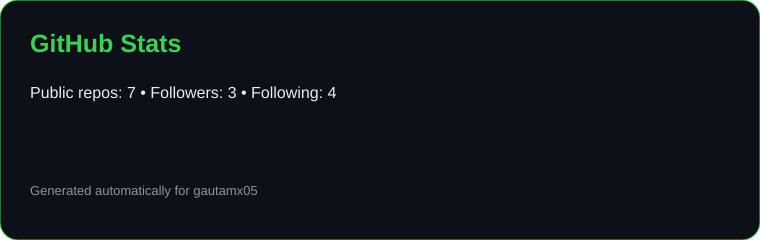
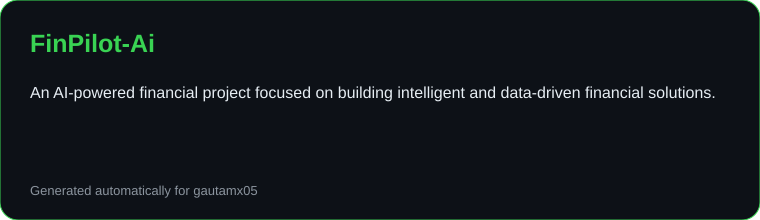

<div align="center">

# `~/` Gautam Chauhan


<br>

<a href="https://www.linkedin.com/in/gautamx05/"></a>
<a href="https://leetcode.com/u/gautamx05/"></a>
<a href="mailto:gautamchauhan3110@gmail.com"></a>

<br><br>


</div>

---

## `~/` whoami

```console
$ cat about.txt
```

Hi, I'm **Gautam Chauhan**, an **AI/ML Engineer & Data Science enthusiast** focused on building intelligent systems with **Artificial Intelligence, Machine Learning, and Generative AI**.

- Currently building **[FinPilot-AI](https://github.com/GAUTAMX05/FinPilot-Ai)**
- Exploring **Artificial Intelligence, Machine Learning & Generative AI**
- Strengthening my **Data Structures & Algorithms** and problem-solving skills
- Building practical, data-driven applications that solve real-world problems

---

## `~/` toolbox

<p align="center">

</p>

---

## `~/` skill radar

<table>
<tr>
<td width="50%" align="center">
<picture>
<source media="(prefers-color-scheme: dark)" srcset="assets/radar-dark.svg">
<source media="(prefers-color-scheme: light)" srcset="assets/radar-light.svg">

</picture>
</td>
<td width="50%" align="center">
<picture>
<source media="(prefers-color-scheme: dark)" srcset="assets/radar-langs-dark.svg">
<source media="(prefers-color-scheme: light)" srcset="assets/radar-langs-light.svg">

</picture>
</td>
</tr>
</table>

---

## `~/` GitHub metrics

<p align="center">
<picture>
<source media="(prefers-color-scheme: dark)" srcset="assets/metrics-calendar-dark.svg">
<source media="(prefers-color-scheme: light)" srcset="assets/metrics-calendar-light.svg">

</picture>
</p>

---

## `~/` contribution graph

<p align="center">
<picture>
<source media="(prefers-color-scheme: dark)" srcset="https://raw.githubusercontent.com/gautamx05/gautamx05/output/snake-dark.svg">
<source media="(prefers-color-scheme: light)" srcset="https://raw.githubusercontent.com/gautamx05/gautamx05/output/snake-light.svg">

</picture>
</p>

---

## `~/` stats

<p align="center">
<picture>
<source media="(prefers-color-scheme: dark)" srcset="assets/stats-dark.svg">
<source media="(prefers-color-scheme: light)" srcset="assets/stats-light.svg">

</picture>
</p>

---

## `~/` featured project

<table>
<tr>
<td width="100%">

### FinPilot-AI

<a href="https://github.com/GAUTAMX05/FinPilot-Ai">

</a>

<br><br>

**FinPilot-AI** — an AI-powered financial project focused on building intelligent and data-driven financial solutions.

<br><br>

<a href="https://github.com/GAUTAMX05/FinPilot-Ai">

</a>

</td>
</tr>
</table>

---

## `~/` connect

<p align="center">
<a href="https://github.com/gautamx05"></a>
<a href="https://www.linkedin.com/in/gautamx05/"></a>
<a href="https://leetcode.com/u/gautamx05/"></a>
<a href="mailto:gautamchauhan3110@gmail.com"></a>
</p>

---

<div align="center">

`01100010 01110101 01101001 01101100 01100100`

**building something worth looking at.**

</div>
